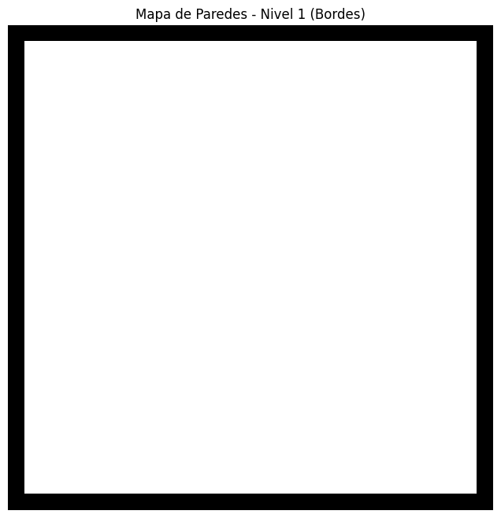

# EXANIMA: Cyber Heresy - Cyberpunk Gothic FPS



EXANIMA es un FPS cyberpunk-gótico inspirado en DOOM, desarrollado con React, TypeScript y Vite. El juego incluye mecánicas avanzadas como wall-run, hackeo, combate contra enemigos biomecánicos y exploración de niveles detallados.

## Características

- Motor gráfico propio con renderizado en canvas.
- Sistema de audio sintetizado y soporte para música MP3.
- Niveles con ambientación cyberpunk y gótica.
- Enemigos con IA avanzada y diferentes tipos de sprites.
- Objetivos y artefactos únicos por nivel.
- Interfaz de usuario con HUD, minimapa y overlays animados.
- Configuración de controles y volumen persistente en localStorage.
- Integración con TailwindCSS para estilos modernos.

## Estructura del Proyecto

```
├── public/                # Recursos estáticos (sprites, música)
├── src/
│   ├── engine/            # Lógica principal del juego (GameEngine, AudioManager, Renderer, etc.)
│   ├── components/        # UI y overlays
│   ├── assets/            # Sprites y gráficos
│   ├── types/             # Tipos y modelos de datos
│   ├── App.tsx            # Componente principal de React
│   ├── main.tsx           # Entrada de la app
│   └── index.css          # Estilos globales (Tailwind)
├── index.html             # HTML principal
├── package.json           # Dependencias y scripts
├── vite.config.ts         # Configuración de Vite
├── tailwind.config.js     # Configuración de TailwindCSS
├── postcss.config.js      # Configuración de PostCSS
└── .gitignore
```

## Instalación

1. Clona el repositorio:
   ```sh
   git clone https://github.com/tu-usuario/exanima-cyber-heresy.git
   cd exanima-cyber-heresy
   ```

2. Instala las dependencias:
   ```sh
   npm install
   ```

3. Inicia el servidor de desarrollo:
   ```sh
   npm run dev
   ```

## Scripts

- `npm run dev` - Inicia el juego en modo desarrollo.
- `npm run build` - Compila el proyecto para producción.
- `npm run preview` - Previsualiza el build de producción.
- `npm run lint` - Ejecuta ESLint.

## Controles

- **WASD** - Movimiento
- **Mouse** - Apuntar
- **E** - Interactuar (recoger fragmentos, activar paneles)
- **Q** - Campo de distorsión temporal
- **F** - Interactuar con reliquias
- **ESC** - Pausa

## Créditos

- Motor y arte original por [Tu Nombre].
- Inspirado en DOOM y estética cyberpunk/gótica.

---

¡Explora la Catedral de Silicio y desata la herejía digital!
